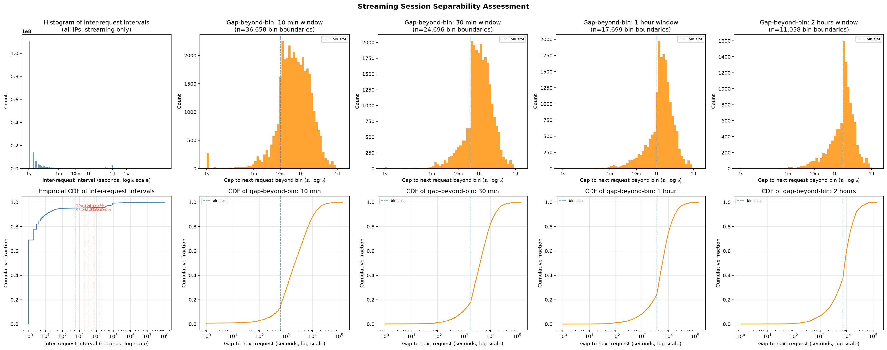
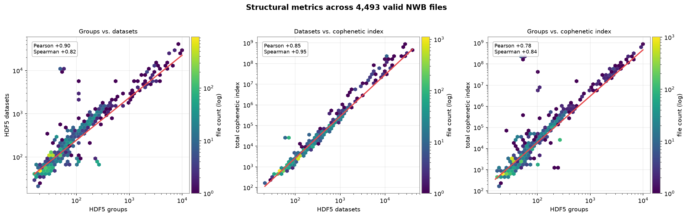
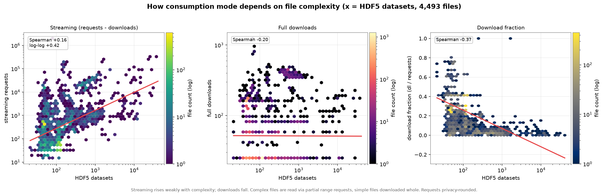
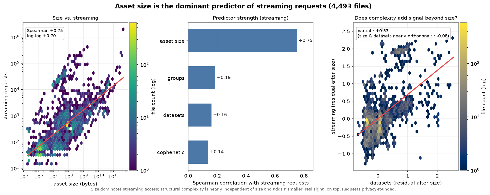

# Defining a "view" for streamed NWB assets on DANDI

*A unit of access for streaming, and why file-property normalization is the wrong correction.*

## Abstract

We propose defining a **view** of a streamed DANDI asset as a **streaming session**:
a burst of partial (range) requests from a single IP address, bounded by gaps of
more than **8 hours**. We motivate the 8-hour threshold empirically from the
distribution of inter-request intervals in the S3 access logs, and we show — by
joining structural-complexity metrics, asset size, and web-access counts across
~4,500 valid NWB files — that normalizing view counts by file size, group/dataset
count, or a tree-balance index would not be *fair*: those quantities either
do not predict genuine interest at all, or predict only the mechanical volume of
requests that the session definition is specifically designed to absorb. Finally, we
show that ~24 % of raw views come from cloud/CI infrastructure (GitHub ~18 %) with no
clean behavioral separator, and that a *bot-clean* view count is best obtained by
excluding automated traffic by IP provenance — specifically the GitHub Actions
ranges — rather than by any per-viewer behavioral heuristic.

---

## 1. Background: requests are not views

DANDI serves NWB assets from S3. Two access modes dominate:

- **Full downloads** — a client retrieves the whole file (HTTP `200`).
- **Streaming** — a client opens the file remotely and issues many **partial
  range requests** (HTTP `206`), reading only the metadata tree and the specific
  datasets it needs. This is how tools such as Neurosift and `remfile`-backed
  notebooks explore a file without downloading it.

A single act of a human exploring one file produces **one download** but can
produce **hundreds to thousands of streaming requests**. Counting raw streaming
requests therefore does not measure interest — it measures a mix of interest and
the mechanical cost of reading a file remotely. To report "views," we need to
collapse each exploration episode into a single countable unit. That unit is a
**session**.

---

## 2. Defining the view: streaming sessions with an 8-hour boundary

We analyzed the inter-request intervals between consecutive streaming requests
from the same IP address across the full extraction cache (~1.37 billion streaming
requests, 46 k unique IPs, ~48 million intervals after excluding a small set of
bot/monitoring assets — see §2.1).

**Within-session activity is extremely tight.** After excluding bot traffic,
99.9 % of consecutive same-IP streaming requests fall within **2 hours**, and the
99th percentile is **18 seconds**. Exploration is bursty: many requests in quick
succession, then silence.

**The natural session boundary is ~5–9 hours.** Sweeping a candidate timeout `T`
across all timescales and measuring the fraction of gaps that fall in a ±10 %
guard band around `T` (the "ambiguity" — gaps that could plausibly be either a
within-session pause or a between-session break), the ambiguity is minimized in a
broad valley from ~4.7 h to ~8.6 h:

| candidate timeout `T` | ambiguous gaps | % of all intervals |
|---|---|---|
| 10 min | 15,546 | 0.0315 % |
| 30 min | 6,572 | 0.0133 % |
| 1 hour | 6,341 | 0.0128 % |
| 2 hours | 6,350 | 0.0129 % |
| **~8 hours (valley)** | **~800** | **0.0017 %** |
| 1 day | 13,214 | 0.0268 % |

The valley sits between two behaviors: **intra-session pauses** (essentially all
under 2 h) and **diurnal returns** (a bump rising after ~21 h). A gap of ~8 h is
the rarest thing a real user does — too long to be a pause, too short to be a
next-day visit — which makes it the most *stable* place to cut.

**Determinism.** There is no literally empty band; at this data volume gaps occur
at every lag. But at the 8-hour valley only ~1 gap in 60,000 is ambiguous, so the
definition is **near-deterministic**: the classification of essentially every
observed gap is unambiguous, and the guard-band count is a concrete metric to
monitor on future data (if it grows, the assumption is weakening). Because the
interval distribution is flat and tiny from 2 h to 8 h, **the session count is
insensitive to the exact threshold anywhere in that range** — a robustness
property that is itself the practical form of determinism.

> **Definition.** A **view** of an asset is a maximal run of streaming (`206`)
> requests from one IP to that asset in which no two consecutive requests are more
> than **8 hours** apart. Full downloads (`200`) are counted separately and are
> not views.

### 2.1 Bots

A small number of "testing" assets are polled by monitoring bots at fixed
intervals (e.g., every ~30 min or ~24 h), which injects artificial mid-range gaps
and pollutes the boundary analysis. These are identifiable — their gaps are
near-100 % *same-asset* (one IP hitting one asset on a clockwork period) and
concentrate on a handful of blobs — and are excluded up front (see
`analysis/testing_blobs.txt`). Excluding them tightened the within-session tail
(99th percentile 149 s → 18 s) and removed a spurious ~1-hour spike, revealing the
clean 5–9 h valley described above.

### 2.1.1 A bot-clean view count: exclude by provenance, not behavior

The boundary-analysis exclusion above (§2.1) removes a handful of clockwork-polled
testing blobs so they do not distort the *8-hour valley*. That is a different, and
much smaller, problem than removing automated traffic from the *published view
count*. Measuring the latter over the whole extraction cache (653,474 assets;
`analysis/measure_view_exclusion_impact.py`, which reuses the production sessionizer
verbatim) shows the contamination is large:

| | views | share of total |
|---|--:|--:|
| total (sessions, all IPs) | 11,871,226 | 100 % |
| from cloud/VPN/CI IP ranges | 2,820,776 | **23.76 %** |
| — GitHub | 2,086,087 | 17.57 % |
| — AWS | 567,608 | 4.78 % |
| — VPN | 122,247 | 1.03 % |
| — GCP | 44,834 | 0.38 % |

Roughly **one in four raw "views" originates from cloud or CI infrastructure, and
GitHub alone is ~18 %.** The effect is wildly uneven by storage type: **67 % of Zarr
views** come from these ranges versus 23.5 % for HDF5 blobs — Zarr assets are
accessed overwhelmingly by automated monitoring.

**Why the exclusion is by IP origin and not by behavior.** There is no clean
behavioral separator for this bot population. Per-viewer session statistics —
session count, inter-request-gap regularity (CV, dominant-period fraction),
distinct-asset breadth, active span — do not cut cleanly, because the dominant bot
here is **GitHub Actions CI**, which behaviorally resembles an engaged human: its
traffic is *bursty and irregular* (runs fire on pushes/PRs/schedules, not on a fixed
period, so a regularity filter catches only ~3 % of request volume and
false-positives on legitimately periodic Zarr chunk bursts), *not low-activity*
(request- and session-count distributions are pure heavy tails with no valley;
`n_sessions ≥ 2` drops ~60 % of viewers while retaining 99.5 % of sessions, and a bot
with one endless session evades it entirely), and *not narrow* (CI can touch many
assets). The signals that actually separate automated from human traffic are not
behavioral but **provenance**: the requester's **IP origin** (cloud/CI ranges) and
the **asset identity** (the reserved testing dandisets). We therefore classify by
origin rather than trying to sessionize-and-classify.

**The GitHub label is not "GitHub Actions."** The coarse `GitHub` label spans the
whole `api.github.com/meta` range set — Actions runners *and* Codespaces, the
web/API, git, packages, and pages. Only the **Actions** ranges are unambiguously CI;
the rest can carry genuine interactive use — a human streaming a file from a notebook
in a Codespace is exactly the engaged view we want to keep. Excluding all of GitHub
would discard those. The shipped definition therefore splits the meta ranges into two
labels — `GH-actions` (the `actions*` keys) and `GitHub` (everything else) — and
**excludes only `GH-actions` from `number_of_views`**, counting non-Actions GitHub
traffic as legitimate. The unique-requester count is unaffected: it continues to
exclude all cloud/VPN/CI ranges, as before.

*Status.* The 23.76 % figure and its GitHub/AWS/VPN/GCP split are measured under the
IP→region labeling in place at the time of writing, where GitHub is still one flat
label. A separate change to that labeling is pending; the post-exclusion
`number_of_views` and the `GH-actions`-vs-rest split will be re-measured once it
lands, rather than re-run against soon-to-change labels.

### 2.2 What the logs can (and cannot) tell us about access method

The only ground-truth calibration we have is a controlled experiment
([issue #74](https://github.com/dandi/s3-log-extraction/issues/74)): one 14 MiB
NWB asset was accessed on 2025-04-29 by four methods, and the resulting S3 log
lines were inspected directly. The summary:

| Method | Status | Bytes-sent pattern | # requests | User-Agent | Our label |
|---|---|---|---|---|---|
| Web download | `200` | full object, one shot | 1 | browser | download |
| DANDI API (`dandi` client) | `200` | full object, one shot | 1 | `dandi/…` | download |
| ROS3 (`pynwb` driver) | `200` HEAD + `206` GETs | mixed, incl. a **whole-file** `206`; ~2× volume (no caching) | several | `-` (empty) | streaming |
| Neurosift | `206` GETs | many partial, **none equal to full size** | many | browser | streaming |

Three consequences for our meta-statistics:

1. **The operation type never identifies the method.** All four log as
   `REST.GET.OBJECT`; the client is invisible except through weak, unreliable hints
   (User-Agent is empty for ROS3 and an identical browser string covers both web
   download and Neurosift). We therefore **cannot partition any statistic by access
   method** — every number in this paper is a method-blended average.
2. **The `200`/`206` → download/stream split is a good approximation, not a
   perfect one.** It is method- and size-dependent: a small file is often sent whole
   in a single `200` regardless of tool, and ROS3 issued a full-object `206` that is
   really a download mislabeled as a stream. These edge cases are rare but nonzero.
3. **Streaming-request *volume* conflates interest with client mechanics.** How many
   `206`s a single viewing produces depends on the client's chunk size and caching —
   ROS3 roughly doubled its requests for lack of a cache; Neurosift emits many small
   ranges; `fsspec`/`remfile` differ again. This is a large part of *why* raw
   streaming-request counts scale with file size, and it is exactly why we count
   **sessions, not requests**: collapsing a burst of `206`s into one view absorbs
   most of this client-dependent inflation. It does not absorb all of it — an
   uncached re-read or a client re-opening a file still registers as activity — and
   because the method is unknowable, such inflation cannot be subtracted. A shift in
   the community's tooling mix (more Neurosift, better caching) would move these
   numbers with no change in underlying interest.

### 2.3 Open calibration question: cross-asset vs. same-asset gaps

The 8-hour timeout was found on the distribution of gaps between an IP's
consecutive streaming requests **across all assets** (§2). But the shipped
`number_of_views` metric applies the timeout **per (IP, asset)** — the gap between
successive touches of the *same* file. Those are different distributions, so we
re-ran the valley analysis on the same-asset gaps the metric actually uses.

*Figure. Same-asset (per-IP, per-asset) streaming gap distribution. The interval
CDF (top-left) flattens near 0.95 then steps up around one day: ~95 % of same-file
gaps are seconds, and the rest are dominated by next-day returns to the same file.*

Two things change under the same-asset scope, and one caveat dominates:

- **The distribution is diurnal-dominated, not short-gap-bimodal.** Only ~95 % of
  same-file gaps are under 10 minutes (vs. 99.8 % cross-asset) and the 99th
  percentile is ~24 h — revisiting a file the next day is common. A
  Google-Analytics-style ~30-minute inactivity timeout therefore does **not**
  transfer; there is no clean sub-hour valley.
- **8 h looks poorly placed under this scope.** The guard-band ambiguity sweep
  peaks near ~8–9 h — i.e., the shipped threshold sits close to an ambiguity
  *maximum* for same-asset gaps rather than the minimum it occupies cross-asset.
- **Caveat (decisive): the same-asset view is heavily bot-contaminated.** Per-(IP,
  asset) grouping amplifies periodic bots — one that pings a file every *N* hours
  produces a clean same-file spike at *N* hours. The 1-day band alone holds ~2.6 M
  gaps (1.6 % of all), and periodic blobs beyond the current `testing_blobs.txt`
  list appear. So the exact locations of the peak (~8–9 h) and the lowest-density
  valley (~30 h) are **preliminary artifacts as much as behavior**.

**Conclusion:** the calibration scope genuinely matters, and 8 h is not obviously
the right timeout for the per-asset metric — but the same-asset distribution must
be cleaned of periodic bots (expand the exclusion list, then re-run `--per-asset`)
before any recalibration is trustworthy. Until then the shipped 8 h stands on its
cross-asset calibration, which is far more bot-robust. This is the clearest
open follow-up from the analysis.

---

## 3. Why not normalize by a file property?

A recurring proposal is to normalize access counts by some intrinsic file
property — size, structural complexity (group/dataset counts), or a tree-balance
index — to "level the playing field" between assets. We joined all of these to
per-asset access counts (~4,493 files across ~253 dandisets; methods in §5) and
find that such normalization would be **unfair** for two distinct reasons.

### 3.1 Structural complexity does not predict interest

The structural metrics are really one axis — group count, dataset count, and the
**total cophenetic index** (a tree-balance metric defined for arbitrary-degree
trees; see the supplement) are rank-correlated 0.82–0.95, with the cophenetic index
essentially a nonlinear restatement of object count (Figure 1). More importantly,
**none of them predicts how much an asset is accessed**: their rank correlation with
streaming volume is only 0.14–0.19.

*Figure 1. The structural metrics are strongly monotonically related; the total
cophenetic index grows as a near power-law in object count. They measure
complexity, not access.*

> We use the **total cophenetic index** here rather than the Sackin index reported
> by the source cache, because the Sackin normalization assumes a binary tree and is
> inappropriate for high-fan-out NWB hierarchies (it is why every published Sackin
> value is negative). That critique — and an empirical check confirming the two give
> the *same* weak access correlation — is in `SUPPLEMENT_tree_metrics.md`.

Dividing a view count by a quantity that is uncorrelated with genuine interest does
not remove a confound — it **injects noise** and arbitrarily penalizes or rewards
assets for internal structure that has nothing to do with why people look at them.
A structurally elaborate file that nobody cares about would be boosted; a simple,
popular file would be suppressed. That is the opposite of fair.

What complexity *does* predict is **consumption mode, not volume** (Figure 2): the
fraction of accesses that are full downloads falls with complexity (Spearman
≈ −0.37). Complex files are explored via partial reads ("scrubbed"); simple files
are grabbed whole. This is exactly why the view definition is built on streaming
sessions — but it is not a basis for normalizing counts.

*Figure 2. Complexity predicts how a file is consumed (scrub vs. download whole),
not how much.*

### 3.2 Size predicts request volume — but the session definition already absorbs it

Asset **size** is a genuinely strong predictor of streaming *requests* (Spearman
**+0.75**; Figure 3) — far stronger than any structural metric, and nearly
independent of them (size and complexity are orthogonal, r ≈ −0.11).

*Figure 3. Asset size dominates streaming-request volume; structural complexity is
orthogonal to size and adds only a small residual signal.*

At first glance this argues *for* size-normalization. But consider **why** size
correlates with streaming requests: a larger file requires **more range requests
to read the same logical content** — more chunks, more metadata, more datasets to
page through. The 0.74 correlation is largely *mechanical*, not a reflection of
greater interest. This is precisely the confound that makes **raw request counts
an unfair unit** — and precisely the confound the **session definition removes**.
One person exploring one file is **one view** whether the client issued 50 range
requests or 5,000. Sessionization collapses the size-driven request inflation into
a single event, so:

- **A raw streaming-request count** *is* confounded by size and would need a size
  correction to be fair.
- **A session-based view count** has already neutralized that confound. Applying a
  further size (or complexity) normalizer would be **double-correcting** —
  penalizing large files a second time for a mechanical cost that the session unit
  has already dissolved.

In other words: the fair correction for the size confound is **to count sessions,
not to divide requests by size.** The residual, size-independent signal that
complexity adds (partial r ≈ 0.49 after controlling for size) reflects real
exploration behavior of complex files and should be *preserved as signal*, not
normalized away.

---

## 4. Recommendation

1. **Report views as streaming sessions** with an 8-hour inactivity boundary,
   per (IP, asset). Count full downloads as a separate quantity.
2. **Do not normalize view counts by size, group/dataset count, or any tree-shape index.**
   Complexity is uncorrelated with interest; size correlates only through a
   mechanical request-inflation effect that the session definition already
   removes. Any such normalizer would either add noise (complexity) or
   double-correct (size).
3. **Exclude automated CI traffic from view counts by IP provenance, not behavior.**
   About 23.8 % of raw views originate from cloud/VPN/CI ranges (GitHub ~18 %), with
   no clean behavioral separator (§2.1.1). Key the exclusion on the narrow
   `GH-actions` label — unambiguous CI — so that genuine interactive use from other
   GitHub-hosted ranges (e.g. Codespaces) is still counted.
4. **Monitor the guard-band ambiguity** (fraction of same-IP gaps within ±10 % of
   8 h) over time as a health check on the definition, and keep the bot-exclusion
   list current.

---

## 5. Methods and reproducibility

- **Sessionization** — `analysis/assess_streaming_sessions.py` computes
  inter-request intervals per IP over the extraction cache, the minimum-density
  valley, the guard-band ambiguity sweep, and per-candidate bot attribution.
- **View-exclusion impact** — `analysis/measure_view_exclusion_impact.py` walks the
  whole extraction cache through the production sessionizer (`_collect_asset_views`)
  and re-applies the production IP-origin predicate to report total vs. kept views by
  service label, with a per-tier sensitivity table. IPs are stored only as a salted
  keyed hash in the co-located parquet/CSV cache; the coarse region label is retained.
- **Access vs. structure** — `analysis/access_vs_structure/build_dataset.py` joins
  the `dandi-cache` structural caches (groups, datasets, total cophenetic index,
  out-degree stats; keyed by content ID) → `content-id-to-nwb-file` →
  `dandi/access-summaries` request/download
  counts, and reads asset sizes via S3 `HEAD`. `plot_relationships.py` renders
  Figures 1–3 and prints the correlation table.

All correlations are reported as Spearman (rank/monotonic) alongside log–log
Pearson, because the distributions are heavily right-skewed and the relationships
strongly nonlinear; raw Pearson understates every monotonic effect here. Access
counts are privacy-rounded at the source (`<50` decoded to 25 and flagged).
Numbers are a snapshot and will drift as the caches and summaries update; re-run to
refresh.

**Known caveats.** (i) The size↔request correlation is measured on *requests*, not
on *sessions*; the claim that sessions neutralize the size confound is argued
mechanistically and should be confirmed by recomputing size correlation against
per-asset **session** counts once those are materialized. (ii) The
content-ID→asset mapping is 1:1, so a deduplicated blob shared by several assets is
scored by one representative asset's counts. (iii) The logs cannot identify the
access method (§2.2), so all statistics blend web/API/ROS3/`fsspec`/Neurosift
traffic and would shift with the community's tooling mix even absent any change in
real interest.
